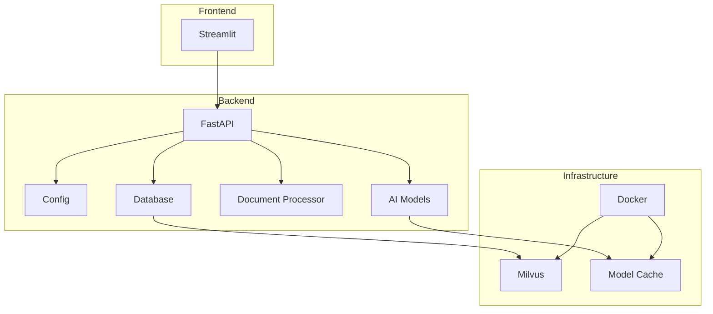

# Text-Extraction-AI

## Overview
The document processing system extracts and structures text from URLs, images (JPG/PNG), and PDF documents, converting content into searchable vector embeddings stored in Milvus database. A FastAPI backend enables text-based querying while generating responses with source citations using transformer-based language models. The complete document analysis pipeline includes a Streamlit web interface for uploading files and submitting queries.

## Key Features
### 1. Data Extraction
The system processes three input types:  
- **URLs**: Extracts main content using smart scraping (removes ads/boilerplate)  
- **Images**: Applies OCR with auto-rotation, contrast adjustment, and noise reduction  
- **PDFs**: Parses text while preserving layouts (tables, columns, headers)  

### 2. Vector Storage
Extracted text is transformed for search:  
- Split into chunks (500 characters with 50-character overlap)  
- Converted to embeddings using `all-MiniLM-L6-v2` model  
- Indexed in Milvus with IVF_FLAT for fast retrieval  

### 3. Query Processing
User questions trigger:  
- Vector similarity search to find relevant text passages  
- Context-aware answer generation via FLAN-T5/GPT  
- Response formatting with source citations  

### 4. API Endpoints
FastAPI provides two key routes:  
- **`/load`**: Accepts files/URLs → processes → stores in Milvus  
- **`/query`**: Takes questions → returns AI answers with sources  

### 5. User Interface
Streamlit offers:  
- Drag-and-drop upload for files/URLs  
- Query input with filters (date, source type)  
- Answer display with highlighted source text  

## Key Technologies
| Component        | Technology Used         |
|------------------|-------------------------|
| Web Extraction   | BeautifulSoup, lxml     |
| Image OCR        | Tesseract               |
| PDF Processing   | pdfplumber              |
| Vector Database  | Milvus (IVF_FLAT index) |
| AI Model         | FLAN-T5/GPT             |
| Backend          | FastAPI                 |
| Frontend         | Streamlit               |

## System Architecture
```
Text-Extraction-AI/
├── backend/                   # FastAPI backend application
│   ├── app.py                 # Main FastAPI application and routes
│   ├── config.py              # Configuration and environment variables
│   ├── database.py            # Milvus database operations
│   ├── document_processor.py  # Text extraction from URLs/PDFs/images
│   ├── models.py              # AI model integration (FLAN-T5/GPT)
│   ├── requirements.txt       # Python dependencies
│   └── __init__.py            # Package initialization
│
├── frontend/                  # Streamlit frontend application
│   ├── app.py                 # Main Streamlit interface
│   └── requirements.txt       # Frontend dependencies
|
├── .env                       # Environment variables
├── docker-compose.yml         # Docker orchestration
└── README.md                  # Project documentation
```

## System Design


## 📦 Installation

### Prerequisites
- Python 3.8+
- Docker Engine
- Tesseract OCR

### Setup
1. Clone repository:
   ```
   bash
   git clone https://github.com/Madhanadeva-D/Text-Extraction-AI.git
   ```

2. Install dependencies:
   ```
   pip install -r backend/requirements.txt
   pip install -r frontend/requirements.txt
   ```

### Running the System:
   ```
   # Start Milvus database
   docker run -d --name milvus -p 19530:19530 milvusdb/milvus:latest
    
   # Launch backend (in separate terminal)
   cd backend
   python -m uvicorn backend.app:app --reload 
    
   # Start frontend (in separate terminal)
   cd ../frontend
   python -m streamlit run app.py
   ```

## Screenshots


